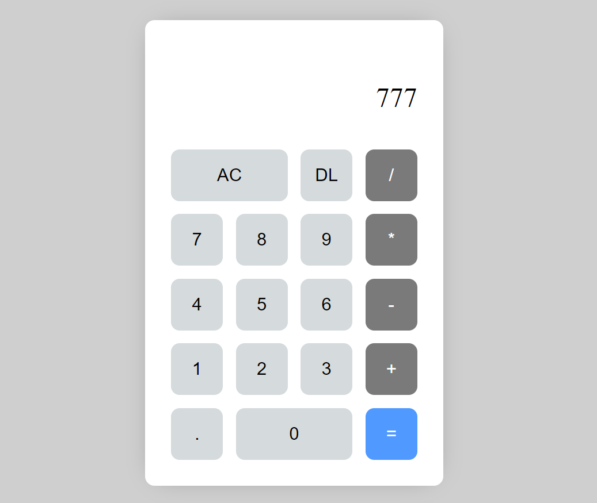

# Web-Calculator

A simple web-based calculator application created using HTML, CSS, and JavaScript.

[]

## Overview

This calculator allows users to perform basic arithmetic operations, including addition, subtraction, multiplication, and division. It features a user-friendly interface with a responsive design and hover effects.

## Features

- Basic arithmetic operations (addition, subtraction, multiplication, division).
- Clear the display.
- Delete the last character in the current input.
- Responsive design for various screen sizes.
- Hover effects for better user interaction.
